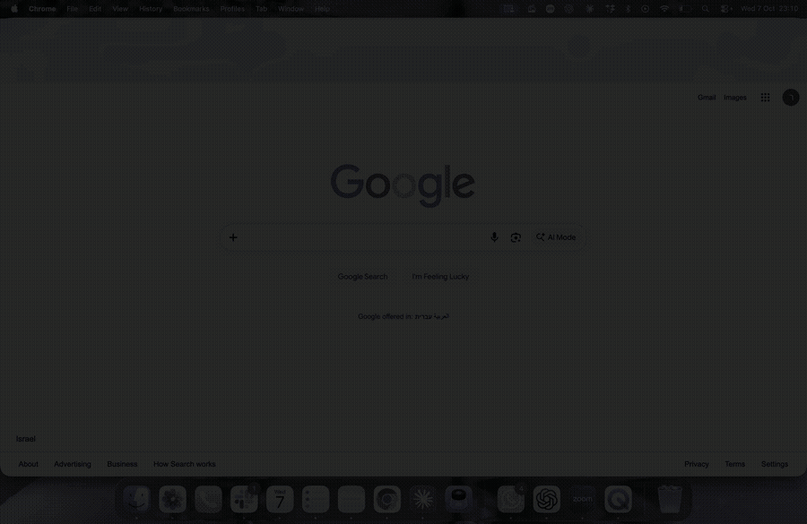

# Mac Recorder

**One shortcut. Your screen, your voice, your face in a circle.**

<p align="center">
  
</p>

<p align="center">
  <a href="https://github.com/RotemElya/mac-recorder/releases/latest"><b>Download ›</b></a>
  &nbsp;·&nbsp;
  <a href="#build-from-source"><b>Build from source ›</b></a>
  &nbsp;·&nbsp;
  <a href="docs/demo.mp4">Demo video</a>
</p>

<p align="center">Free and open source. For macOS 14 and later.</p>

> The demo is an animation drawn over a real screenshot of a Mac desktop, not a live capture.
> The green circle is where the camera bubble appears.

## Out of sight, within reach

macOS can record your screen, but it takes a few clicks to set up every time.
Mac Recorder lives in the menu bar and opens with one shortcut: **Cmd+Shift+9**.

A small panel shows three buttons. That is the whole app.

| Button | What it does |
| --- | --- |
| **Record / Stop** | Starts or stops the screen recording. |
| **Mic on / off** | Turns your microphone on or off. Works while you record. |
| **Camera on / off** | Shows your camera in a round bubble in the top-left corner. |

## A shortcut for everything

- **Press `Cmd+Shift+9`** to open the panel.
- **Press it again** to close the panel. While you record, it brings the panel back so you can stop.
- **Right-click the menu bar dot** to quit.
- **The red timer** in the menu bar shows that a recording is running.

## What makes it different

- **The panel is never in your video.** It hides itself from the recording.
- **The camera bubble is.** It is part of the picture, so your viewers see you.
- **The camera is on only when it has to be.** It runs while the panel is open or while you record, and turns off otherwise. Your camera light is not on all day.
- **Your video is an `.mp4`** in `~/Movies/Recordings`, and Finder opens on it when you stop.

## Private by design

- The app has no network code. It does not send anything anywhere. You can check: it is one file, [`Sources/main.swift`](Sources/main.swift).
- It asks macOS for three permissions (Screen Recording, Microphone, Camera) and uses each one only for what you see on the screen.
- It saves your recordings on your Mac and nowhere else.

## Tech specs

| | |
| --- | --- |
| Works on | macOS 14 and newer |
| Size | about 200 KB |
| Language | Swift, one file (~500 lines), no dependencies |
| Frameworks | AppKit, ScreenCaptureKit, AVFoundation, Carbon (global shortcut) |
| Output | H.264 `.mp4`, your screen's full resolution, 30 fps |
| Audio | Microphone only. System sound is not recorded. |
| License | MIT |

## Install

### Download (no tools needed)

1. Download `MacRecorder.zip` from the [latest release](https://github.com/RotemElya/mac-recorder/releases/latest) and unzip it.
2. Drag `MacRecorder.app` to `Applications`.
3. macOS blocks apps that are not signed by an Apple developer account, and this one is not. Open the Terminal and run this once:

   ```bash
   xattr -dr com.apple.quarantine /Applications/MacRecorder.app
   ```

4. Open the app, press `Cmd+Shift+9`, and allow **Screen Recording**, **Microphone** and **Camera** when macOS asks.
   After you allow Screen Recording, quit the app (right-click the dot, then Quit) and open it again.

### Build from source

You need the Xcode command line tools (`xcode-select --install`).

```bash
git clone https://github.com/RotemElya/mac-recorder.git
cd mac-recorder
./install.sh
```

The script builds the app, copies it to `/Applications` and starts it when you log in.

**You need the whole repository.** `install.sh` builds from `Sources/main.swift`, `Info.plist` and `build.sh`. If you copy only some of the files, it will not work. Always clone the full repo.

### Install with your AI assistant

If you use an AI coding assistant (Claude Code, Cursor, Codex and others), you can give it this repo and let it do the steps:

> Clone https://github.com/RotemElya/mac-recorder, read the README, and install it on my Mac.

The assistant can read this file, run `install.sh`, and fix small problems on the way. It still cannot press the macOS permission buttons for you. You allow Screen Recording, Microphone and Camera yourself.

### Remove

```bash
./uninstall.sh
```

## Change the shortcut

```bash
defaults write dev.macrecorder.app hotkey -string "ctrl+option+r"
```

Quit and reopen the app. Use `cmd`, `shift`, `option`, `ctrl` plus one letter, digit or `space`.

## Inside the app

Everything is in [`Sources/main.swift`](Sources/main.swift):

- `CameraBubble` shows the round camera preview.
- `Recorder` captures the screen with ScreenCaptureKit and writes the `.mp4` with `AVAssetWriter`. The microphone comes from a capture session next to it.
- `ControlPanel` is the three-button panel. It is excluded from the capture.
- `AppController` ties it together: the menu bar item, the global shortcut and the timer.

## Good to know

- The app is signed locally, not with an Apple developer account. That is why a downloaded copy needs the `xattr` step above.
- macOS can ask you again to allow screen capture from time to time. That is a macOS rule for apps that record the screen directly.
- Not yet tested on a clean Mac other than the author's.

## License

MIT
